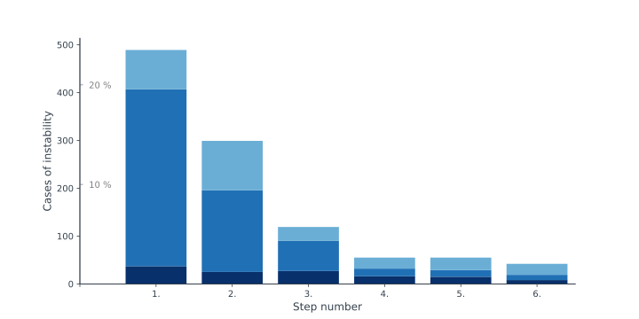

# Cognitive Expansion for Walknet 

Locomotion in animals provides a model for adaptive behavior as it is able to deal with various kinds of perturbations. Work in insects suggests that this evolved flexibility results from a modular memory architecture which can be characterized by a recurrent neural network allowing for various emerging attractor states. While a lower control-level coordinates muscle activation patterns and joint movements on a short timescale, a higher level handles action selection on longer timescales. Implementation of such a control system on a walking robot was able to deal with disturbances such as uneven terrain or loss of a leg. 

Here, we address how this system can deal with novel problematic situations. To this end, it is extended towards a cognitive system that is able to invent new behaviors and to plan ahead. Following a bottom-up approach and using a grounded internal body model, planning is realized as a form of internal simulation of possible actions which are applied out of their original context. Exploiting the decentralized memory architecture, this cognitive expansion allows to test and predict properties of newly invented behaviors, while the body is decoupled from the control system. If such a behavior provides a solution, the newly introduced sensory-motor memory element representing a short term memory is then finally tested on the six-legged robot Hector. We demonstrate the feasibility of this control approach for walking and climbing over terrain with uncertain footholds, and we systematically analyze how it deals with disturbances to normal walking. 

This repository contains the python code for the control network: on the one hand, it consists of the decentralized locomotion architecture Walknet (see [Schilling et al., 2013a](https://link.springer.com/article/10.1007/s00422-013-0563-5)) which can produce adaptive behavior. This is, on the other hand, extended by a cognitive expansion (Schilling et. al, submitted) that can take over when encountering unstable situations and resolving these through testing behaviors out of context. The repository contains the main code of the controller which is written in Python3. There are three experimental settings showing adaptive and cognitive behavior.

In order to run the code, the dynamic simulation environment is required which is realized in C++ and based on the Open Dynamics Engine library, see [https://github.com/malteschilling/hector] (https://github.com/malteschilling/hector) . 

The robot simulator implements a generic simulation environment and a communication protocol to connect controller and simulator (or the real robot) is realized, see Schneider et al, 2011).

For more details on the robot Hector see [Schneider et al., 2014](https://link.springer.com/chapter/10.1007/978-3-319-09435-9_51).

--

### Install and Setup

This is the code base of the cognitive expansion and the walknet controller which is used to control the robot Hector. For running this code you require the Hector simulator.

In order to run simulations (the python controller and bioflexbus communication interface has been adapted to work under Mac OS X as well):

* Install the Hector simulator (see [https://github.com/malteschilling/hector] (https://github.com/malteschilling/hector) ) and run the simulator.
* Clone/download this controller git repository – ideally, you put both these folders side by side in one parent folder (controller requires some libraries from the simulator for establishing the Bioflexbus protocol and some xml description files).
* compile the BioFlex communication interface to connect controller and simulator: in the comminter folder call 'make'
* Control of the stance movement has been optimized and realized as a fast version in C++ directly. Therefore, you have to compile this SWIG library as well (tested under linux and Mac OS X): call 'make -C controller/reaCog/Movements/BodymodelStance/SWIG_MMC_Lib/ all' from the cognitiveWalker directory.
* Start the controller calling one of the three experiments, e.g.: 'python3 -O exp_undisturbed_walking.py'

Problems: when simulator and and controller folder are not in the same directory (or you renamed the hector folder) - you have to provide the path to the hector folder twice: once in the Makefile while compiling the communication interface. Second, in the __main__ file the XML description files are required ('protocolXmlDirectory="../hector/BioFlexBusProtocolXmls/" ').

--

### Experiments

In the accompanying paper (Schilling et al., submitted) there are a couple of experiments. Here, the code for the simulation experiments is given. The experiments can be started (important: the Hector simulator has to be running already as he is acting as the server) through the python3 call.

There are several parameters that can be set -- these are located in controller/reaCog/WalknetSettings.py. Usually, one should be only interested in changing the velocity in order to observe different emerging gaits (examples of emergent gaits are shown in the supplemental PDF). This parameter is called "default_speed" and shoulw be in the range of 0.004 (leads to slow wave gait) to 0.020 (tripod gait).

These are the different experiments:

* Undisturbed walking (call 'python3 -O exp_undisturbed_walking.py') -- you can set different velocities as described above. This will automatically save results and footfall patterns in the logs folder (this recreates Fig. S1). This is explained in detail in the supplement in result section 1).
* Induce a long step in the simulated robot (this is similar of experiment 2) presented in the supplement and article, but there this was applied on the physical robot). This is called as 'python3 -O exp_forced_long_step.py'. The disturbance is introduce as a simple list that contains when the disturbance should be introduced and which legs should produce a long step (line 61 in exp_forced_long_step.py, called 'randomLongStep'). The enforced long step in the simulation is quite large (double step size), but can be adapted in 'experiment_main.py', line 169, changing the displacement in the numpy.array. Such long steps can lead to instable postures that require the cognitive extension to resolve the problematic situation and apply a behavior out of context (this will lead to results as reported in table 1 and shown in figure S3 and comparable to figure 3 in the paper).
* Last, we systematically varied postures as starting postures and counted how many of these lead to instable walking. Furthermore, we looked at the statistics of how often the cognitive system was able to resolve these and find a solution where the adaptive system would have got stuck. This lead to a series of simulations (2080 runs when systematically varying starting posture, for detailed explanation see supplemental). This series is called as a shell script: './exp_run_start_posture_variations.sh'. Again, this can be done for different walking speeds. Results are shown in table 3 and 4 in the supplement as well as in Fig. S4 (and shown below).

Instabilities of the control architecture (without using the cognitive extension) when forced into systematically varied starting postures. Abscissa: number of robot steps. Light Blue: duration of instabilities between 10 ms and 100 ms; blue: duration longer than 100 ms, but only appearing during a single step cycle of that particular leg; dark blue: long instabilities (longer than 100 ms) and found in subsequent steps of the walking robot. Shown for high velocity (0.020).

--

### Content

The repository consists of multiple folders:

* controller - contains implementation of the reaCog control approach (decentralized, individual leg controllers and coordination rules as implemented in Walknet; plus the cognitive expansion)
* GeometryXmls, geomparse - 3D visualization files of Hector and environment - and read method for loading the file on the python side (required to obtain robot variables)
* Hector - interface for connecting to sensors and motors of Hector.
* ProcessOrganisation - generic scheme for running the simulations in modules (and visualizations as well).
* comminter - establishes a connection towards the simulator.
* tools
* Visualization - scripts for afterwards visualizing footfall patterns etc. 

--

### References

* Schilling, M., Paskarbeit, J., Ritter, H., Schneider, A., and Cruse, H. (submitted). From Adaptive Locomotion to Predictive Action Selection – Cognitive Control for a Six-Legged Walker.
* Schilling, M., Hoinville, T., Schmitz, J., & Cruse, H. (2013a). Walknet, a bio-inspired controller for hexapod walking. Biological Cybernetics, 107(4), 397-419. doi:10.1007/s00422-013-0563-5
* Schilling, M., Paskarbeit, J., Hoinville, T., Hüffmeier, A., Schneider, A., Schmitz, J., & Cruse, H. (2013b). A hexapod walker using a heterarchical architecture for action selection. Frontiers in Computational Neuroscience, 7, 126. doi:10.3389/fncom.2013.00126
* Schneider, A., Paskarbeit, J., Schilling, M., & Schmitz, J. (2014). HECTOR, a bio-inspired and compliant hexapod robot. Proceedings of the 3rd Conference on Biomimetics and Biohybrid Systems, Living Machines 2014, 427-430.